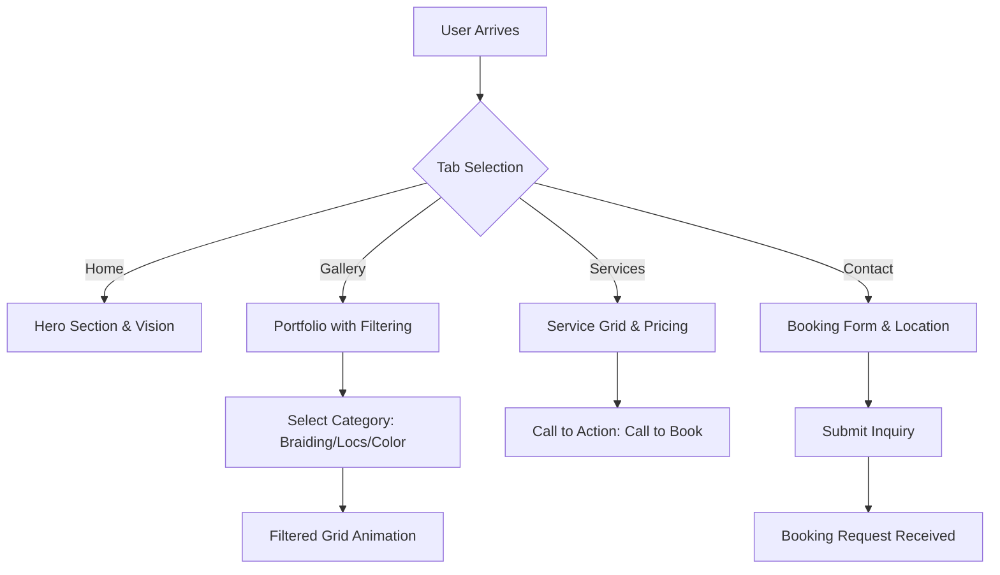
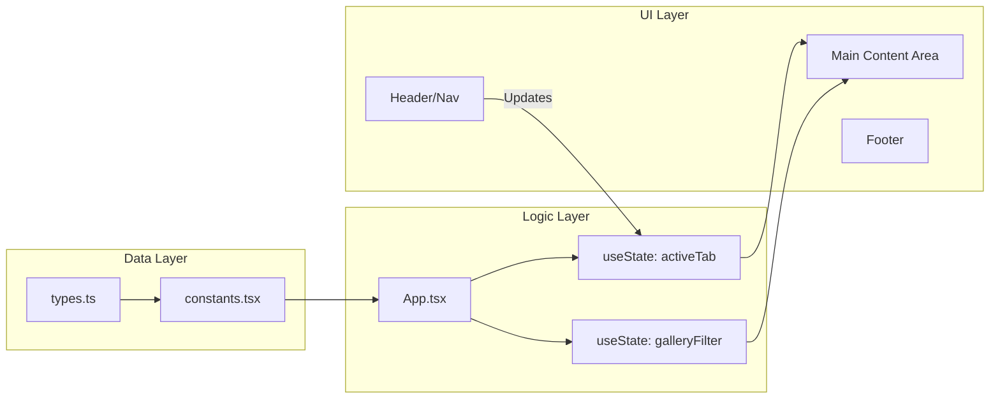

# Midway Mews - Hair & Beauty Salon Web Application

A premium, single-page application (SPA) designed for **Midway Mews hair beauty salon** located in Halfway Gardens, Midrand. This application provides a high-end editorial experience for clients to explore services, view professional portfolios, and initiate bookings.

---

## 🏛️ Application Architecture

The app is built using a modern **Component-Based Architecture** with a focus on high-performance rendering and fluid user experiences.

### Tech Stack
- **Framework:** React 19 (Functional Components & Hooks)
- **Styling:** Tailwind CSS (Utility-first approach for premium aesthetics)
- **Animations:** Framer Motion (Orchestration and layout transitions)
- **Gallery:** Swiper (Touch-optimized sliders)
- **Icons:** Custom SVG pathing for performance

---

## 🔄 App Flow Diagram

The following diagram illustrates the user journey through the application and the conditional rendering logic.

---

## 📊 Data & State Flow

The application centralizes its content in a decoupled constants file to ensure easy maintenance and SEO updates.

---

## 🛠️ Key Functions & Sections

### 1. Dynamic Tab System (`activeTab`)
- **Logic:** Uses `useState` to manage the currently visible section. 
- **User Experience:** Wrapped in `AnimatePresence`, allowing sections to fade and slide in/out gracefully when the user navigates.

### 2. Service Showcase (`SERVICES`)
- **Logic:** Maps through a curated list of objects containing titles, descriptions, and South African Rand (ZAR) pricing.
- **Visuals:** Uses card-based layouts with hover scaling effects.

### 3. Portfolio Management (`GALLERY_ITEMS`)
- **Logic:** 
    - Implements a **Layout Projection** algorithm using Framer Motion. 
    - Categories are derived dynamically using a `Set` of tags.
    - Filtering recalculates the grid and animates items into their new positions using the `layout` prop.
- **Layout:** Features an editorial masonry-style grid where every 4th item spans multiple rows for visual interest.

### 4. Interactive Contact & Booking
- **Functionality:** 
    - Integrates native `tel:` and `mailto:` protocols for immediate client engagement.
    - Includes a dynamic Google Maps deep link for the Halfway Gardens location.
    - Managed form state for "Request Appointment" interactions.

### 5. Responsive Design & Scroll Logic
- **Header State:** A scroll listener monitors `window.scrollY`. When exceeded (50px), the header transitions from transparent to a blur-frosted glass effect (`backdrop-blur`).

---

## 📈 SEO & Performance
- **Fonts:** Optimized loading of *Playfair Display* (Serif) and *Montserrat* (Sans) via Google Fonts.
- **Imagery:** High-resolution assets served with `auto=format` parameters to ensure cross-browser speed.
- **Accessibility:** ARIA-compliant navigation items and semantic HTML5 tags throughout.

---
*Created for Midway Mews hair beauty salon - Midrand, ZA.*
